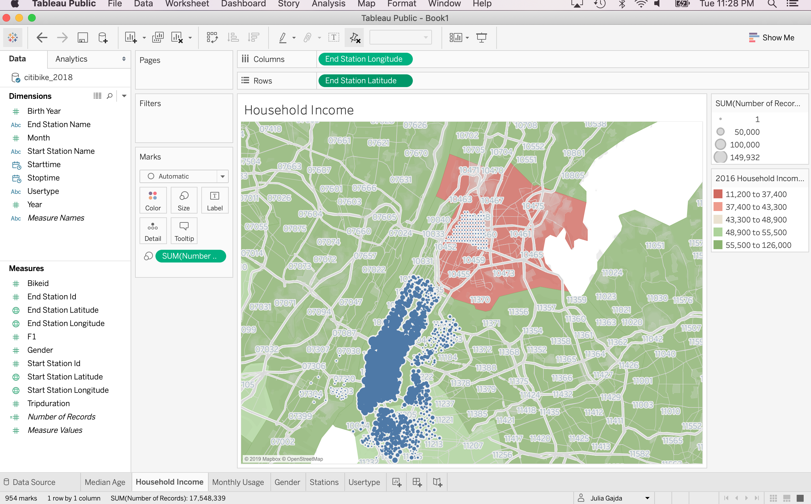

# 2018 CitiBike Tableau

  

## My discovered phenomena with Tableau supporting visualizations
Once I chose my dataset of 2018 and performed ETL I was able to answer the below questions based off my visualizations. 

  

### Phenomena 1: Age of Users
* What is the median age of CitiBike users?

The 2018 average user was 38 years old and not what I originally hypothesized. I assumed the average CitiBike user would be a college student and overall individuals much younger in age. 

  

### Phenomena 2: Household Income
* What is the median household income of CitiBike subscibers?

The 2018 average median household income was between $55.5k - $126K which correlates to highest usage areas that tend to be urban with higher cost of living. This was not suprising but there was a patch of users that fell in the lowest income bracket of $11.k - $37.4k that contained subscribers commuting to the city by bike weekly. This leads me to assume that the bikes being rented in The Bronx area will require future repairs and more repairs than bikes being utilized in urban areas for shorter distances by subscribers. 

  

### Phenomena 3: Weather
* What time of year is the busiest? 
* What is median duration users rent bikes?
* What is the minimum time users rent bikes?
* Does month and weather affect duration of rental?

According to the visualization for 2018 majority of bikes were rented during the summer months with usage during August being the busiest month for CitiBike rentals. The median trip duration was 654.25 seconds and minimum trip time of 61 seconds all year with weather not affecting ride duration. 

  

### Phenomena 4: Usertype
* What is the average gender of CitiBike users?
* Who utilizes CitiBike rentals most, subscribers or customers?
* Does location affect usertype?

The average gender of CitiBike users in 2018 was Males by 68% then Females with 23% and lastly 8% of users gender was unknown.
I also mapped the usertype which showed that 9 out of 10 users in 2018 were subscribers. I think location does affect usertype since we notice that the stations located in The Bronx are primarily used by customers and not subscribers like urban areas. This leads me to assume individuals living farther out of the city own cars or use other forms of public transportation like the train instead of renting CitiBikes for their daily commute.

